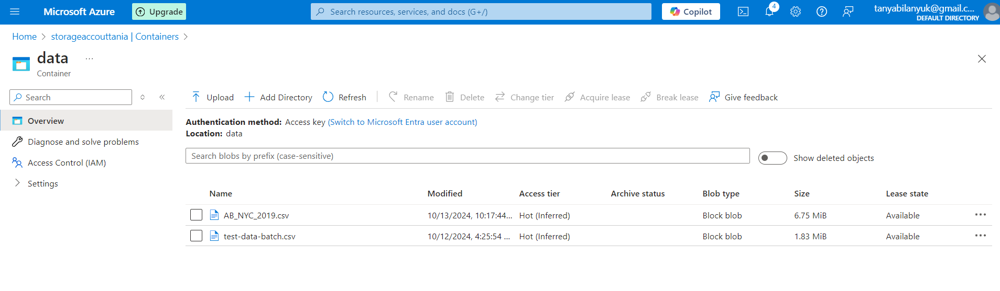
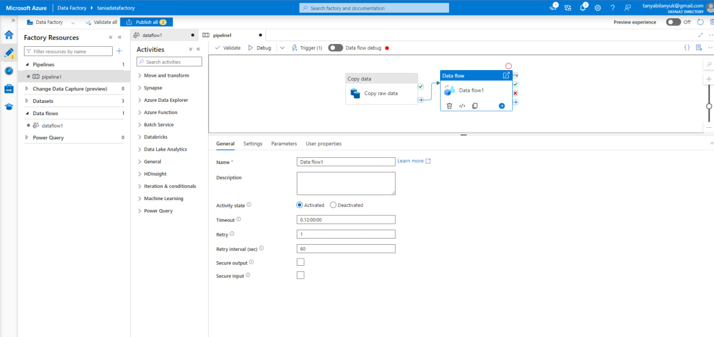
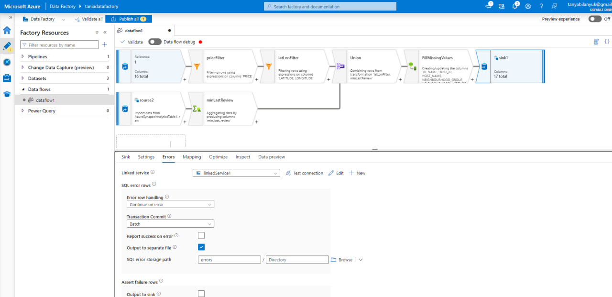
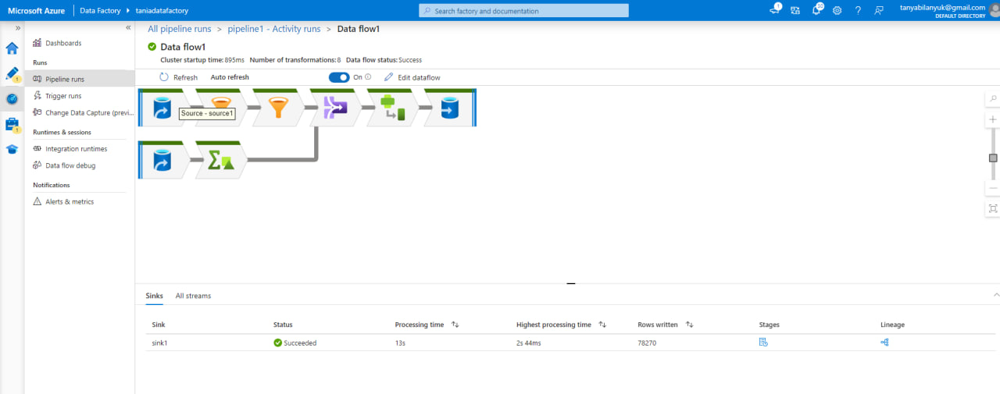
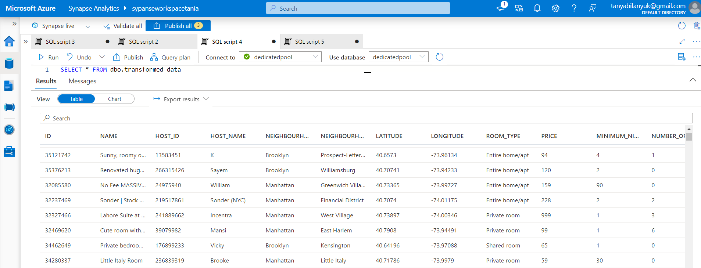
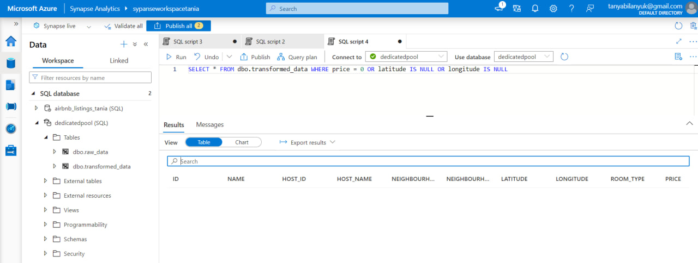
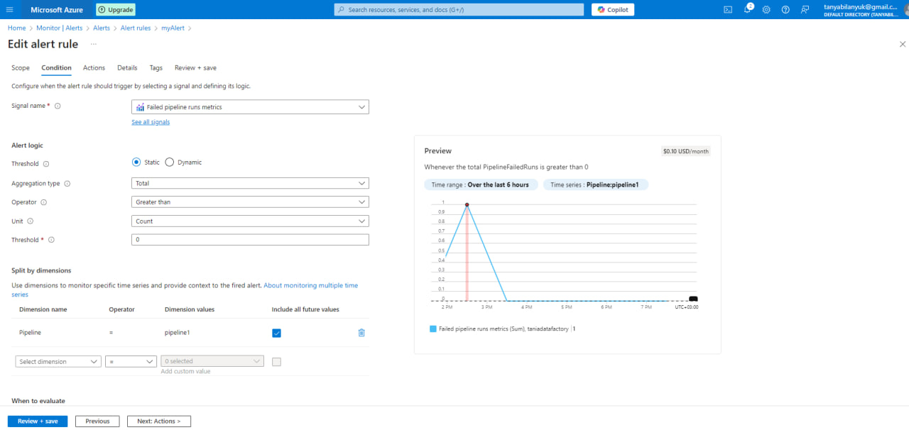

# Azure homework

This is an ETL pipeline using Azure Blob Storage, Azure Data Factory (ADF), and Azure Synapse Analytics. The goal is to automate the
process of ingesting, transforming, and loading data from the NYC Airbnb dataset CSV file.

The pipeline uses Blob Storage for storing data, ADF for data transformation and orchestration, and Synapse Analytics for querying.

To use this you need to do the following:
1. Create Free-Tier account in Azure.
2. Create resource group.
3. Create storage account, within that account create a container and load csv files.
4. Create Synapse workspace with sql pool (serverless option didn't work for me).
5. In Synapse Studio create a sql script and use statements from `sql-scripts.sql` to create tables within sql pool.
6. Set up Azure Data Factory, open Azure Data Factory Studio.
7. Link Blob Storage and Synapse Analytics, add Datasets pointing to csv files container and both raw and transformed data tables.
8. Create pipeline with `Copy Data` and `Data Flow` activities (all pipeline settings are in `pipeline_config` folder).
9. Add triggers to run pipeline when new files are added and schedule pipeline to run daily.
10. In Azure Monitor create an alert when pipeline fails.

### Storage account container example:

### Pipeline with retry policy

### Data flow details with error handling

### Successful run of data flow

### Transformed data

### Transformed data without invalid values in price, latitude and longitude columns.

### Alert rule details
